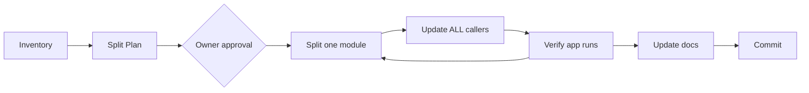

# Refactor God-Files — Task Brief

This is a **copy-paste task brief**. The owner hands it to any project session whose codebase contains god-files (see root `CLAUDE.md`, Rule #20). It is generic — it names no project; the session discovers its own targets in Phase 0.

## Table of Contents

- [What You Are Being Asked to Do](#what)
- [Procedure](#procedure)
  - [Phase 0 — Inventory](#phase-0)
  - [Phase 1 — Split Plan (discussion only)](#phase-1)
  - [Phase 2 — Execution](#phase-2)
  - [Phase 3 — Documentation](#phase-3)
  - [Phase 4 — Commits](#phase-4)
- [Hard Constraints](#constraints)
- [Definition of Done](#done)

---

<a id="what"></a>

## What You Are Being Asked to Do

This project violates **Rule #20 — Cohesive Modules, No God-Files**: one or more source files have grown far past ~1,000 lines and accumulated multiple unrelated responsibilities (window + widgets + dialogs + theming + helpers in one file is the canonical example).

Your task: **split every god-file into cohesive modules — one responsibility per file — with ZERO behavior change.**

This is a pure structural refactor. The application must behave identically before and after, verified at every step.



---

<a id="procedure"></a>

## Procedure

<a id="phase-0"></a>

### Phase 0 — Inventory

Measure every source file and report the offenders **before touching anything**:

```powershell
Get-ChildItem -Recurse -Include *.py,*.js,*.ts |
  Where-Object { $_.FullName -notmatch 'build|dist|venv|node_modules|__pycache__' } |
  ForEach-Object { [PSCustomObject]@{ Lines = (Get-Content $_.FullName | Measure-Object -Line).Lines; File = $_.Name } } |
  Sort-Object Lines -Descending
```

Classify per Rule #20: **> ~1,000 lines = violation** (split target), **~500–1,000 = smell** (list it, ask whether it holds more than one responsibility), **≤ ~500 = leave alone**.

<a id="phase-1"></a>

### Phase 1 — Split Plan (discussion only)

For EACH god-file, read it and produce a plan — **no code yet** (Rule #11):

1. **List the responsibilities actually inside it** — e.g. "main window shell, 4 complex widgets, 3 dialogs, theming, clipboard helpers"
2. **Propose a module map** — split along **class/responsibility boundaries**, never by line ranges:

```
📁 gui/
  📝 ___gui.md
  🐍 main_window.py      ← window shell, layout, signal wiring
  🐍 canvas_widget.py    ← one complex widget per file
  🐍 settings_dialog.py  ← one dialog per file
  🐍 theme.py            ← palette, QSS/CSS, styling constants
```

3. **Flag risks** — shared module-level state, circular-import hazards, name collisions
4. **WAIT for owner approval** of the map before writing anything

<a id="phase-2"></a>

### Phase 2 — Execution

Split **one module at a time**, verifying after each move:

1. Move one cohesive unit (a class or tightly-coupled class group) into its new file
2. Update **ALL** imports and callers — find every one with Grep (Rule #6)
3. **Delete** the moved code from the original file — never leave a copy
4. Launch the application and exercise the moved functionality — it must behave identically
5. Only then move the next unit

The original file shrinks with every step and ends as either a small focused module itself or just the package entry point.

<a id="phase-3"></a>

### Phase 3 — Documentation

Per Rule #3 (MD-First):

- New package folder gets `___folder.md` (purpose, files, connections)
- Each significant new module gets its `.md` beside it
- Update every existing `.md` that referenced the old file
- Verify the navigation chain: every new `.md` reachable from the project `README.md`

<a id="phase-4"></a>

### Phase 4 — Commits

Follow the project's version numbering (`0.0.000 description`). Split logically, e.g.:

```
x.y.NNN   GUI package — extract widgets from gui.py into gui/ modules
x.y.NNN+1 GUI package — extract dialogs and theme
x.y.NNN+2 Documentation — folder and module docs for gui/ package
```

---

<a id="constraints"></a>

## Hard Constraints

1. **ZERO behavior change.** No fixes, no improvements, no renames "while you're at it". If you find a bug — report it, do not fix it in this refactor.
2. **No compatibility shims** (Rule #6). No re-export wrappers, no `from gui import *` bridges kept "just in case". Update every caller, delete the old path.
3. **No mechanical splits.** `gui_part1.py` / `gui_part2.py` is forbidden — cohesion decides the boundaries, never line counts.
4. **No over-fragmentation.** Do not produce dozens of 30-line files. A small helper class may live with the widget that owns it. Target: focused modules of roughly 100–500 lines.
5. **No version-suffix files** (Guideline #2). Edit and move directly — Git keeps history.
6. **Verify before claiming** (Guideline #1). "It still works" requires an actual launch and an actual test of the moved feature, reported concretely.

---

<a id="done"></a>

## Definition of Done

- [ ] No source file over ~1,000 lines (or its `.md` documents WHY it must stay whole)
- [ ] Every new module has exactly one responsibility, roughly 100–500 lines
- [ ] Zero imports of the old god-file path remain (verified with Grep)
- [ ] Application launched and exercised — behavior identical
- [ ] `___folder.md` + per-module `.md` files written; navigation chain from `README.md` intact
- [ ] Commits follow the version system, grouped logically
